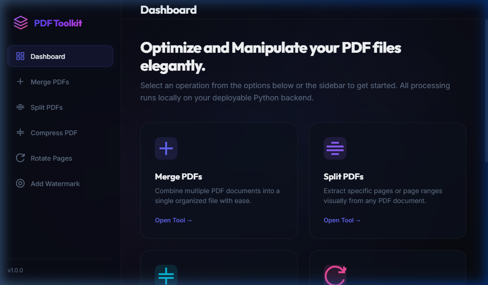
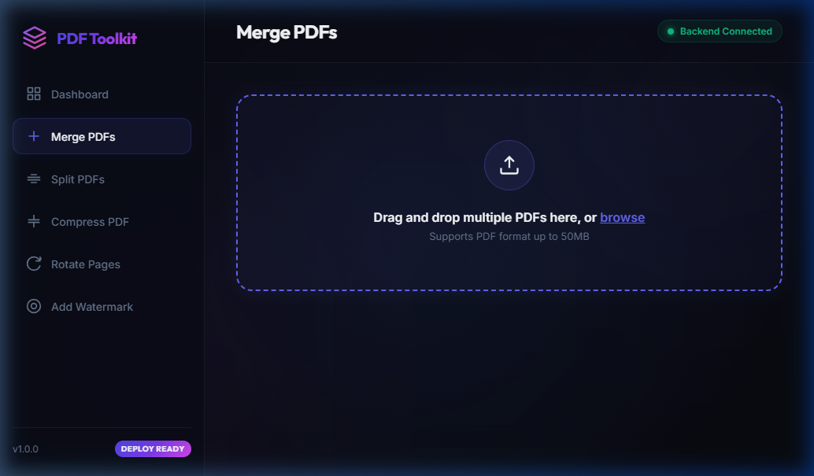

# PDF Toolkit

An elegant, fully-featured, and deployable PDF manipulation toolkit built with a Python (FastAPI) backend and a modern glassmorphism SPA frontend.

## Previews

### Dashboard View


### Merge PDFs Workspace


## Features

- **Merge PDFs**: Upload multiple files, visually arrange their order via navigation controls, and merge them into a single PDF document.
- **Split PDFs**: Extract specific pages. Select pages visually by clicking on dynamically rendered thumbnail previews of the document, or input a custom page range (e.g., `1-3, 5`).
- **Compress PDFs**: Optimize and compress uncompressed text and drawing streams inside the PDF using standard quality presets (Low, Medium, High). Show original size, compressed size, and percentage of space saved.
- **Rotate Pages**: Visually rotate pages individually by 90-degree increments, or rotate all pages at once before saving.
- **Add Watermark**: Apply text overlays to all pages. Custom controls include text content, font family, size, color, opacity slider, rotation angle slider, and multiple positioning presets (including repeating tiled overlay) with a real-time layout preview.

## Architecture

- **Backend**: FastAPI web server running Python `pypdf` for PDF stream operations, and `reportlab` for real-time dynamic watermark generation.
- **Frontend**: Single-page application using modern Vanilla HTML5/CSS3 glassmorphism, responsive styles, custom widgets, SVG icons, and Mozilla's `pdf.js` CDN to render high-fidelity visual PDF canvas previews directly inside the client browser.

---

## Local Setup

### 1. Prerequisites
- Python 3.8 or higher installed on your system.

### 2. Installation
Clone or navigate to the project directory and install dependencies:
```bash
pip install -r requirements.txt
```

### 3. Run the Server
Start the development server using uvicorn:
```bash
python main.py
```
Or run directly:
```bash
python -m uvicorn main:app --reload --port 8000
```
Open your browser and navigate to `http://localhost:8000`.

---

## Deployment Guide

This project is structured for easy deployment to cloud services like Render, Heroku, or Hugging Face Spaces.

### 1. Deploying to Render (Web Service)
- Create a new **Web Service** on Render.
- Connect your GitHub repository containing this project.
- Configure settings:
  - **Environment**: `Python`
  - **Build Command**: `pip install -r requirements.txt`
  - **Start Command**: `python main.py` or `python -m uvicorn main:app --host 0.0.0.0 --port $PORT`
- Click **Deploy Web Service**. Render will automatically provision the environment, install packages, bind to the correct port, and spin up the uvicorn server.

### 2. Deploying to Hugging Face Spaces (Docker Space)
Create a new space using the **Docker** SDK, and add a `Dockerfile` in the root:
```dockerfile
FROM python:3.9-slim

WORKDIR /app

COPY requirements.txt .
RUN pip install --no-cache-dir -r requirements.txt

COPY . .

# Run uvicorn server on port 7860 (Hugging Face default)
CMD ["python", "-m", "uvicorn", "main:app", "--host", "0.0.0.0", "--port", "7860"]
```

### 3. Deploying to Heroku
Heroku will automatically discover the `requirements.txt` file and build it using the Python buildpack.
- Add a file named `Procfile` containing:
  ```text
  web: uvicorn main:app --host 0.0.0.0 --port $PORT
  ```
- Push to your Heroku app remote.

### 4. Deploying to Vercel
This repository is configured for easy zero-config deployment to Vercel using Python Serverless Functions.
- Create a new project in the Vercel Dashboard.
- Connect your GitHub repository containing this project.
- Click **Deploy**. Vercel will automatically read the `vercel.json` and `requirements.txt` configurations, build the serverless functions under `/api`, and deploy the application.


